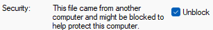

# Asset Extractor

A modular python library (basically a set of scripts) to read the assets.xml, resolve dependencies, and convert into legible formats. Supports localization and icon conversion.

## Setup
### Simple Setup
1. Clone this repository.
    * Either download and unzip: https://github.com/anno-mods/asset-extractor/releases/download/1.0/asset-extractor.zip
    * Or install [GitHub Desktop](https://desktop.github.com/download/) and inside GitHub desktop use the following link to clone the repository: https://github.com/anno-mods/asset-extractor.git
2. Right click on `simple_setup.ps1` and click on `Run with PowerShell` in the context menu. In case the window immediately closes do the following:
    1. Right click on the file, click properties, and check `unblock` (skip this step if there is no such checkbox). Refer to the image for guidance:
    
    2. Right click in the explorer and click "Open in Terminal"
    3. Type and hit enter: `Set-ExecutionPolicy -ExecutionPolicy Bypass -Scope Process -Force`
    4. Type and hit enter: `.\simple_setup.ps1`
3. The script will **automatically**:
   - Check out the latest version
   - Install Visual Studio Code, Git, and uv (if not already installed)
   - Set up the Python environment with required dependencies
   - Install .NET 6 Desktop Runtime (required for RDAConsole)
   - Download and extract RDAConsole from the latest GitHub release
   - Test that RDAConsole.exe runs correctly
   - Install ImageMagick (required for Python Wand image processing)
   - Set MAGICK_HOME environment variable
   - Create `config.json` from the template
   - Run initial RDA extraction from your game directory
4. Visual Studio Code should open with `browsing.ipynb`. Follow the instructions in the notebook to get started.
5. See `assetextractor/conversion/README.md` for converter usage examples.

**Important**: Run `extract.cmd` whenever there is a game update to refresh the extracted files.

### Manual Setup

1. Setup Python environment

   1. Ensure you have `uv` installed. You can download it from [here](https://docs.astral.sh/uv/getting-started/installation/).

   2. Open a terminal in this folder:

   3. Create a virtual environment:
        ```sh
        uv python install # Not needed if you already have Python 3.13+ installed
        uv sync # Run uv 'sync --extra jupyter' if you want to use Jupyter Notebooks
        ```

   4. Activate the virtual environment (Optional):
    - On Windows:
        ```sh
        .\venv\Scripts\activate
        ```
    - On macOS and Linux:
        ```sh
        source venv/bin/activate
        ```

2. Install .NET 6 Desktop Runtime (required for RDAConsole):
   - Download from: https://dotnet.microsoft.com/download/dotnet/6.0
   - Or use direct link: https://aka.ms/dotnet/6.0/windowsdesktop-runtime-win-x64.exe

3. Download RDAConsole:
   - Download the latest release from: https://github.com/anno-mods/RdaConsole/releases/latest
   - Extract to `./RDAConsole/` folder in the repository root

4. Install ImageMagick (required for Python Wand):
   - Download from: https://imagemagick.org/script/download.php#windows
   - During installation, check all checkboxes (except Perl related)
   - Set `MAGICK_HOME` environment variable to installation path (e.g., `C:\Program Files\ImageMagick-7.1.1-Q16-HDRI`)
   - Verify installation by running `magick -version` in command prompt

5. Check that `game_path` in `config.json` points to the installation directory of your Anno game. Make sure to use '/' or '\\\\' as path separators

6. Extract RDA files by running:
   ```sh
   # Run the extraction script
   extract.cmd
   # Or manually with uv:
   uv run python -m assetextractor.extraction.extract
   ```
   This extracts:
   - All files from `config.rda`
   - Icon files from `ui.rda`
   - `.ifo` files from `graphics_*.rda` files

7. **Important**: Run `extract.cmd` whenever there is a game update to refresh the extracted files.

8. Run the project:

    ```sh
    # You can use 'uv run' to run files inside the venv if it's not activated
    uv run main
    ```

### Development

You should install development dependencies to run typechecking and linters. You can do this by running:

```sh
uv sync --dev
```

To run `ruff` for linting and formatting, alongside `pyright` for type checking, you can run:

```sh
uv run nox
```

If you're using VS Code, you can also press `Ctrl + Shift + B` to run nox.

You should ensure all nox pipelines pass before pushing your changes.

## Overview
The project consists of 3 modules (their source code is located in a subfolder of `assetextractor` with the corresponding name):

1. `extraction`: Opens the RDA files of the game and extracts the xml, dds, cfg and other required files. These are stored in the cache directory. The extraction module uses RDAConsole.exe to extract files from game RDA archives.
2. `parsing`: Reads the xml files and restores their hierarchy in memory. Their main components are (all of them have corresponding Python classes in this project):

    * Templates (stored in `templates.xml`): These define the structure of a group of assets (e.g. product, population level, item, trigger). In analogy to object oriented programming these are the classes whereas assets are the objects.
    * Assets: Concrete instances (e.g. grain, farmer). However, not all attributes are listed in the `assets.xml` but some are derived from `templates.xml` or `properties.xml`. The extractor takes care of resolving all inheritances such that on every asset all its attributes are defined and have a value - thus the output of `print_tree()` on an asset is much bigger than what you can find in `assets.xml`.
    * Properties: These are the building blocks of assets. They can be arbitrarily nested. At the leaves of the tree they span are attributes.
    * Attributes: These contain the concrete values (e.g. durations, counts). Additionally, there is a meta definition for each attribute (in `properties-toolone.xml`). The meta definition defines the data type, allowed values and - in most cases - contains a descriptive comment. To see the meta definition of a template, asset, or property, call `print_meta_tree`. See `AttributeFactory` in `assetextractor/parsing/core/attributes.py` for an overview and how data types are mapped to Python classes.
    * Datasets: Each dataset is an ordered collection of string literals (like enums in Java or C). Certain attributes (e.g. of data type Array, Choice, or Flags) reference a dataset where values are from. To get all literals for such an `attribute`, call `attribute.meta.dataset.literals`
3. `conversion`: Contains several converters to generate excerpts of the assets in different formats (e.g. HTML, JSON) for different programs (e.g. asset browser, calculator). See `assetextractor/conversion/README.md` for details.


